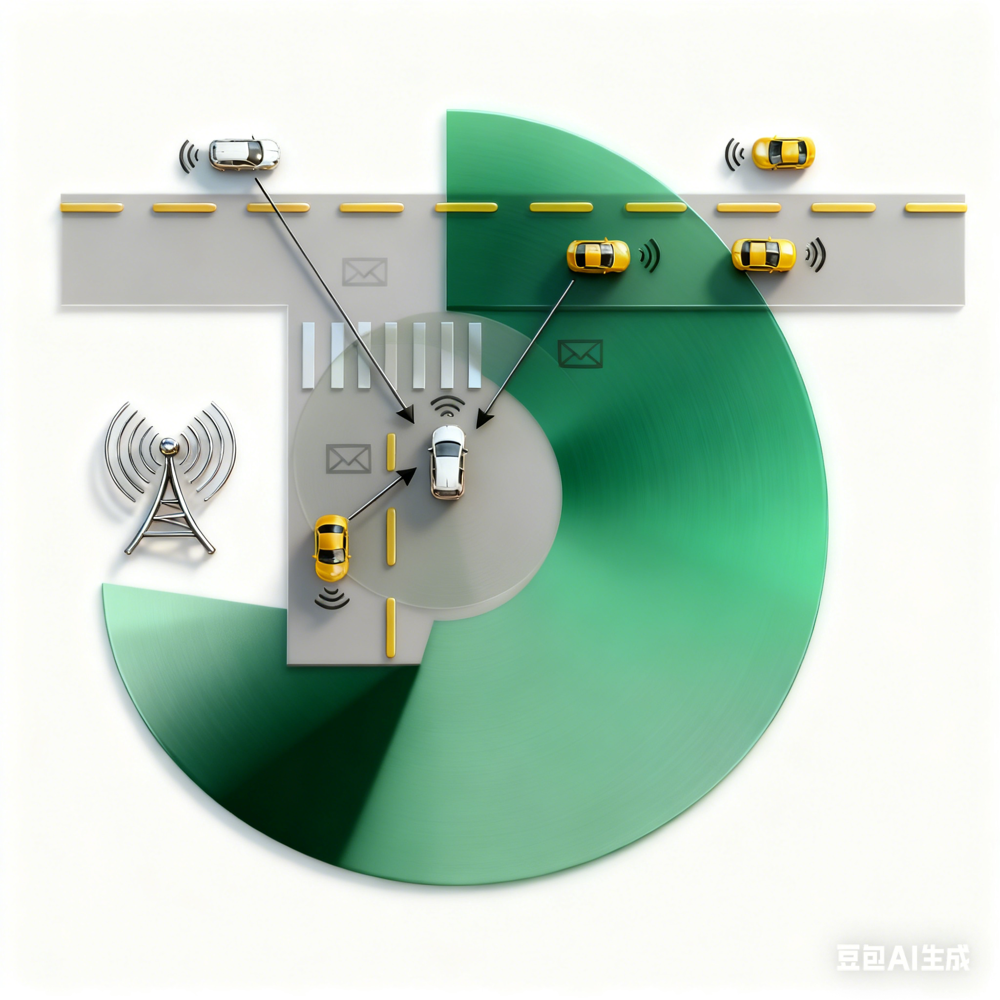
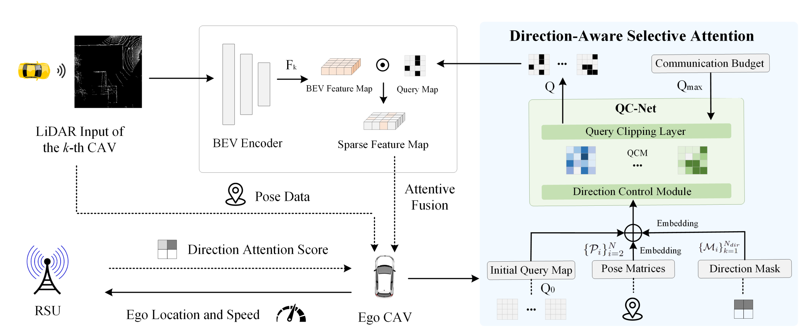
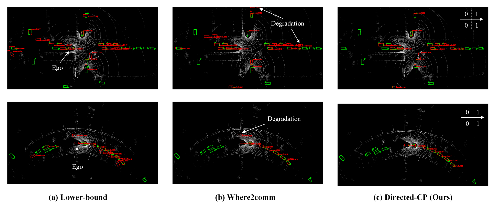
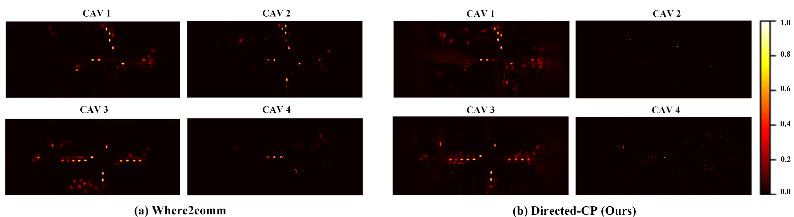

<div align="center">

    
## [ICRA 2025] Directed-CP: Directed Collaborative Perception for Connected and Autonomous Vehicles via Proactive Attention

[](https://ieeexplore.ieee.org/document/11127818)
[](https://arxiv.org/abs/2409.08840)
[](./LICENSE)
[](https://www.python.org/)
[](https://pytorch.org/)
 
</div>

---

> **Directed-CP: Directed Collaborative Perception for Connected and Autonomous Vehicles via Proactive Attention**<br>
> [Yihang Tao](https://scholar.google.com/citations?user=YopoapwAAAAJ&hl=en), [Senkang Hu](https://scholar.google.com/citations?user=rtPVwT8AAAAJ&hl=en), [Zhengru Fang](https://scholar.google.com/citations?user=yggQMJMAAAAJ&hl=zh-CN), [Yuguang Fang](https://scholar.google.com/citations?user=cs45mqMAAAAJ&hl=en)<br>
> IEEE International Conference on Robotics and Automation (ICRA), 2025<br>

> **Abstract:** *Collaborative perception (CP) leverages visual data from connected and autonomous vehicles (CAV) to expand an ego vehicle's field of view (FoV). Despite recent progress, current CP methods do expand the ego vehicle's 360-degree perceptual range almost equally, but faces two key challenges. Firstly, in areas with uneven traffic distribution, focusing on directions with little traffic offers limited benefits. Secondly, under limited communication budgets, allocating excessive bandwidth to less critical directions lowers the perception accuracy in more vital areas. To address these issues, we propose Directed-CP, a proactive and direction-aware CP system aiming at improving CP in specific directions. Our key idea is to enable an ego vehicle to proactively signal its interested directions and readjust attention to enhance local directional CP performance. To achieve this, we first propose an RSU-aided direction masking mechanism that assists an ego vehicle in identifying directions. Additionally, we design a direction-aware selective attention module to wisely aggregate pertinent features based on ego vehicle's directional priorities, communication budget, and the positional data of CAVs. Moreover, we introduce a direction-weighted detection loss (DWLoss) to capture the divergence between directional CP outcomes and the ground truth, facilitating effective model training. Extensive experiments on the V2X-Sim 2.0 dataset demonstrate that our approach achieves 19.8% higher local perception accuracy in interested directions and 2.5% higher overall perception accuracy than the state-of-the-art methods in collaborative 3D object detection tasks.*

---

## 🔥 Highlights

- **🎯 Direction-Aware CP**: First framework to enable proactive directional perception enhancement based on ego vehicle's interests
- **🛰️ RSU-aided DAS**: Novel direction attention scoring mechanism utilizing roadside units for traffic density monitoring
- **🔄 QC-Net**: Query Control Network with Direction Control Module and Query Clipping Layer for intelligent feature selection
- **📊 DWLoss**: Direction-weighted detection loss that optimizes perception in critical directions
- **📈 SOTA Performance**: 19.8% improvement in local directional accuracy and 2.5% overall improvement on V2X-Sim 2.0

---

## 📰 News

* **2025.01.19**: Directed-CP is accepted by [ICRA 2025](https://2025.ieee-icra.org/).
* **2025.09.05**: Directed-CP paper is available on [IEEE Xplore](https://ieeexplore.ieee.org/document/11127818).

---

## 🏗️ Architecture

### Overall Framework

<div align=center>

</div>

Directed-CP enables ego vehicles to proactively signal interested directions and adaptively allocate communication resources. The framework consists of three key components:

1. **RSU-aided Direction Masking**: Identifies important directions based on traffic density
2. **Direction-Aware Selective Attention (QC-Net)**: Intelligently selects features from collaborative CAVs
3. **Direction-Weighted Detection Loss**: Optimizes model training for directional perception

### QC-Net Architecture

QC-Net consists of:
- **Direction Control Module**: Generates direction-prioritized Query Confidence Maps (QCMs)
- **Query Clipping Layer**: Selects top-k queries under communication budget constraints

---

## 📊 Visualizations

### Collaborative Detection Results

<div align=center>

</div>

**Comparison of collaborative 3D detection results on V2X-Sim 2.0 dataset.** Green and red boxes denote ground truth and predictions, respectively. While Where2comm improves global perception over the lower-bound baseline, it faces limitations in certain directions. Directed-CP enhances perception in ego's interested directions (marked as 1, with right arrow showing ego CAV's movement), achieving superior accuracy in critical areas.

### Attention Weight Visualization

<div align=center>

</div>

**Attention weight visualization on neighboring CAVs.** Where2comm distributes attention equally for omnidirectional perception, while Directed-CP focuses on features relevant to ego's interested directions. This demonstrates how our direction-aware selective attention mechanism effectively prioritizes critical regions, reallocating communication resources from less important CAV 2 and CAV 4 to more crucial CAV 1 and CAV 3, improving perception in the ego vehicle's target directions.

---

## 🚀 Quick Start

### Installation

Directed-CP is built upon the [Where2comm](https://github.com/MediaBrain-SJTU/Where2comm) codebase. Please follow the installation instructions from Where2comm repository for environment setup:

👉 **[Where2comm Installation Guide](https://github.com/MediaBrain-SJTU/Where2comm#install)**

**Quick Setup:**

```bash
# Clone this repository
git clone https://github.com/your-username/Direct-CP-Lidar.git
cd Direct-CP-Lidar/Where2comm

# Install dependencies (after setting up Where2comm environment)
pip install -r requirements.txt
python setup.py develop
```

### Dataset Preparation

**V2X-Sim 2.0 Dataset**

1. Download the [V2X-Sim 2.0](https://drive.google.com/drive/folders/1NMag-yZSflhNw4y22i8CHTX5l8KDXnNd) dataset.

2. Organize the dataset:

```
Directed-CP-LiDAR/
└── Directed-CP/
    └── dataset/
        ├── V2X-Sim-2.0/
        │   ├── agent_1/
        │   ├── agent_2/
        │   └── ...
        └── v2xsim2_info/
            ├── v2xsim_infos_train.pkl
            ├── v2xsim_infos_val.pkl
            └── v2xsim_infos_test.pkl
```

3. Verify dataset:

```bash
python -c "import pickle; data=pickle.load(open('dataset/v2xsim2_info/v2xsim_infos_train.pkl','rb')); print(f'Training samples: {len(data)}')"
```

---

## 🎓 Training

### Train from scratch

```bash
# Single GPU
python opencood/tools/train.py \
    --hypes_yaml opencood/hypes_yaml/v2xsim2/v2xsim2_directcp_attn_multiscale_resnet.yaml

# Multi-GPU (4 GPUs)
python -m torch.distributed.launch \
    --nproc_per_node=4 \
    opencood/tools/train_ddp.py \
    --hypes_yaml opencood/hypes_yaml/v2xsim2/v2xsim2_directcp_attn_multiscale_resnet.yaml

# Or use the provided script
bash scripts/train_directcp.sh
```

### Resume training

```bash
python opencood/tools/train.py \
    --hypes_yaml opencood/hypes_yaml/v2xsim2/v2xsim2_directcp_attn_multiscale_resnet.yaml \
    --model_dir opencood/logs/v2xsim2_directcp_attn_multiscale_resnet/<timestamp>
```

### Monitor training

```bash
# Start TensorBoard
tensorboard --logdir=opencood/logs --port=6006

# Open browser: http://localhost:6006
```

**Expected Training Output:**

```
============================================================
  Directed-CP Communication Module Initialization
============================================================
✓ RSU-aided DAS: ENABLED
  - Sigma1 (relative threshold): 0.1
  - Sigma2 (absolute threshold): 0.15
✓ Gaussian Smoothing: ENABLED (k=5, σ=1.0)
✓ QC-Net: ENABLED
  - Input dim: 100x252 = 25200
  - Hidden dim: 512
  - Direction priorities: [0.9, 0.9, 0.1, 0.1]
✓ Communication budget: 250 features
✓ Confidence threshold: 0.01
============================================================

Training start
learning rate 0.002000

[Directed-CP Forward #1]
  RSU-aided DAS Scores (Front-R, Front-L, Back-L, Back-R):
    ['0.383', '0.383', '0.117', '0.117']
  Direction Mask: [1, 1, 1, 1]
  Activated Directions: 4 / 4
  QC-Net Output:
    Selected queries: 249 / 25200
    Sparsity: 0.99%
    Budget: 250 (ratio: 0.010)
[epoch 0][1/1333] || Loss: 259.1276 || Conf Loss: 928.1762 || Loc Loss: 4.2941 
...
[Directed-CP Forward #4]
  RSU-aided DAS Scores (Front-R, Front-L, Back-L, Back-R):
    ['0.433', '0.359', '0.098', '0.110']
  Direction Mask: [1, 1, 0, 1]
  Activated Directions: 3 / 4
  QC-Net Output:
    Selected queries: 747 / 75600
    Sparsity: 0.99%
    Budget: 250 (ratio: 0.010)
[epoch 0][2/1333] || Loss: 50.0084 || Conf Loss: 55.4845 || Loc Loss: 137.4835
```

---

## 🔬 Evaluation

### Inference on test set

```bash
python opencood/tools/inference.py \
    --model_dir opencood/logs/v2xsim2_directcp_attn_multiscale_resnet/<timestamp> \
    --fusion_method intermediate

# Or use the provided script
bash scripts/inference_directcp.sh opencood/logs/v2xsim2_directcp_attn_multiscale_resnet/<timestamp>
```

### Evaluation metrics

The evaluation will report standard AP metrics:
- **AP@IoU=0.5/0.7**: Average Precision at IoU thresholds 0.5 and 0.7
- **AP@PD-IoU=0.5/0.7**: Partial-Direction AP for interested directions (Front-Right, Front-Left)
- **Communication Rate**: Ratio of transmitted features to total features


## ⚙️ Configuration

### Key Parameters

Modify `opencood/hypes_yaml/v2xsim2/v2xsim2_directcp_attn_multiscale_resnet.yaml`:

```yaml
# Communication module configuration
communication:
  direction: [0.9, 0.9, 0.1, 0.1]  # Directional priorities
                                    # [Front-R, Front-L, Back-L, Back-R]
  use_rsu_das: true                # Enable RSU-aided DAS
  das_sigma1: 0.1                  # Relative threshold
  das_sigma2: 0.15                 # Absolute threshold
  budget: 250                      # Communication budget
  
# Loss function configuration
loss:
  core_method: direction_weighted_point_pillar_loss
  args:
    dir:
      mode: 'N'                    # Non-independent mode
      weight: [0.9, 0.9, 0.1, 0.1] # Direction weights
      dsigma: 1.0                  # Weight control factor
      th: 0.1                      # Activation threshold
```

### Scenario-Specific Configurations

```yaml
# Urban intersection (focus front)
direction: [0.9, 0.9, 0.1, 0.1]

# Highway (focus front & back)
direction: [0.8, 0.2, 0.2, 0.8]

# Lane change (focus right side)
direction: [0.7, 0.3, 0.2, 0.8]

# Parking (uniform attention)
direction: [0.5, 0.5, 0.5, 0.5]
```

---

## 📁 Project Structure

```
Directed-CP/
├── opencood/
│   ├── models/
│   │   ├── comm_modules/
│   │   │   ├── qcnet.py              ← QC-Net implementation
│   │   │   ├── rsu_das.py            ← RSU-aided DAS computation
│   │   │   └── where2comm.py         ← Integrated communication module
│   │   └── point_pillar_where2comm.py
│   ├── loss/
│   │   └── direction_weighted_point_pillar_loss.py  ← DWLoss
│   ├── hypes_yaml/
│   │   └── v2xsim2/
│   │       └── v2xsim2_directcp_attn_multiscale_resnet.yaml
│   └── tools/
│       ├── train.py                  ← Training script
│       └── inference.py              ← Inference script
├── scripts/
│   ├── train_directcp.sh             ← Training launcher
│   ├── inference_directcp.sh         ← Inference launcher
└── README.md                         ← This file
```

---


## 🙏 Acknowledgments

This project is built upon the excellent [OpenCOOD](https://github.com/DerrickXuNu/OpenCOOD) codebase. We thank the authors for their outstanding work:

```bibtex
@inproceedings{xu2022opencood,
  author = {Runsheng Xu, Hao Xiang, Xin Xia, Xu Han, Jinlong Li, Jiaqi Ma},
  title = {OPV2V: An Open Benchmark Dataset and Fusion Pipeline for Perception with Vehicle-to-Vehicle Communication},
  booktitle = {IEEE International Conference on Robotics and Automation (ICRA)},
  year = {2022}
}
```

We also acknowledge the contributions from:
- [Where2comm](https://github.com/MediaBrain-SJTU/Where2comm) for the baseline attention mechanism
- [V2X-Sim 2.0](https://ai4ce.github.io/V2X-Sim/) for the comprehensive dataset

---

## 📧 Contact

For questions and discussions, please contact:

- **Yihang Tao**: yihangtao2-c@my.cityu.edu.hk


---

## 📄 Citation

If you find Directed-CP useful in your research, please consider citing:

```bibtex
@INPROCEEDINGS{tao_directcp,
  author={Tao, Yihang and Hu, Senkang and Fang, Zhengru and Fang, Yuguang},
  booktitle={2025 IEEE International Conference on Robotics and Automation (ICRA)}, 
  title={Directed-CP: Directed Collaborative Perception for Connected and Autonomous Vehicles via Proactive Attention}, 
  year={2025},
  pages={7004-7010}
}
```

---

## 📜 License

This project is released under the [MIT License](./LICENSE).

---

<div align="center">

**Made with ❤️ by the JC STEM Lab of Smart City, City University of Hong Kong**

[🏠 Homepage](https://jcstemlab.netlify.app/) • [📧 Contact](mailto:yihangtao2-c@my.cityu.edu.hk) • [📝 Paper](https://ieeexplore.ieee.org/document/11127818)

</div>
